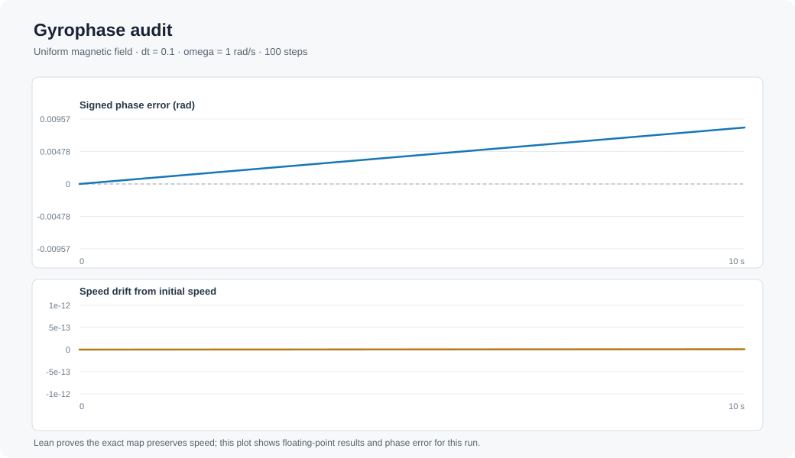

# GyroProof

GyroProof studies one narrow question in charged-particle numerics: how can a time step preserve a particle's speed exactly and still accumulate an error in its gyro phase?

The project pairs a small Lean 4 proof with a Julia simulation. Lean states the magnetic-only Boris velocity update as a rational two-dimensional map and proves that it preserves squared speed and is undone by reversing the time step. Julia applies the same map repeatedly, then compares the simulated velocity angle with the exact uniform-field angle at the same time.

## What is in this repository

- `lean/GyroProof/Boris.lean` defines the update and states the two algebraic results.
- `scripts/phase_ledger.jl` writes a CSV record and a compact SVG plot for a chosen run.
- `Project.toml`, `lakefile.lean`, and `lean-toolchain` describe the Julia and Lean environments.

The ledger keeps two facts separate: the magnetic-only update preserves speed, while its discrete rotation angle differs from the continuous gyro angle. For signed cyclotron frequency `omega` and step `dt`, the update rotates by `-2 atan(omega * dt / 2)` per step; the exact velocity rotates by `-omega * dt`. The resulting phase discrepancy is numerical error, not a new physical effect.

The sign convention and derivation are written out in [the math note](docs/MATH.md).

## Run the Julia ledger

With Julia installed, from this directory run:

```powershell
julia --project=. scripts/phase_ledger.jl --dt 0.1 --steps 100 --omega 1.0 --output results/phase_ledger.csv --svg results/phase_ledger.svg
```

The CSV contains one row per step, including time, simulated speed, exact phase, numerical phase, and signed phase error. The SVG plots phase error and speed drift from that same run. `omega` is the signed value `qB/m`; the initial velocity is `(1, 0)`. The script uses only Julia standard libraries.

On Windows, `scripts/run.ps1` builds the Lean project and produces the reference CSV and SVG. It uses the project-local toolchains in the original workspace when present; elsewhere, make `lake` and `julia` available on `PATH` first.

## Reference run

This plot and its [CSV data](results/phase_ledger.csv) were produced by the Julia script with `dt = 0.1`, `steps = 100`, and `omega = 1.0`.



## Check the Lean proofs

With Lean and Lake installed, from this directory run:

```powershell
# PowerShell
$env:MATHLIB_CACHE_DIR = ".cache/mathlib"
lake update
lake build
```

For a POSIX shell, set `MATHLIB_CACHE_DIR=.cache/mathlib` in the environment before running the two Lake commands.

The Lean project uses Mathlib for real-number algebra tactics. The statements concern the exact rational map defined in `Boris.lean`; they do not certify floating-point behavior of Julia or claim that a complete particle trajectory integrator has zero position error.

## Scope and prior work

The Boris method and its phase error are established topics. This repository does not claim to invent the Boris method, discover a new law of physics, or establish that no one has formalized this update before. Its contribution is the specific, inspectable pairing of a machine-checked statement about the two-dimensional velocity map and a reproducible numerical phase ledger.

Useful background:

- Zenitani and Umeda, [On the Boris solver in particle-in-cell simulation](https://arxiv.org/abs/1809.04378), *Physics of Plasmas* (2018).
- Higuera and Cary, [Structure-preserving second-order integration of relativistic charged particle trajectories](https://arxiv.org/abs/1701.05605), *Physics of Plasmas* (2017).
- [Theorem Proving in Lean 4](https://lean-lang.org/theorem_proving_in_lean4/), the Lean community's introduction to Lean proofs.

## Current verification status

The Lean project has been built successfully with Lean 4.19.0 and Mathlib v4.19.0. The Julia script has also been run with Julia 1.13.1; the reference run preserved speed to the displayed precision and ended with a signed phase error of about `0.0083208556` radians. These results apply to the stated update and parameters.

The code is released under the [MIT License](LICENSE).
